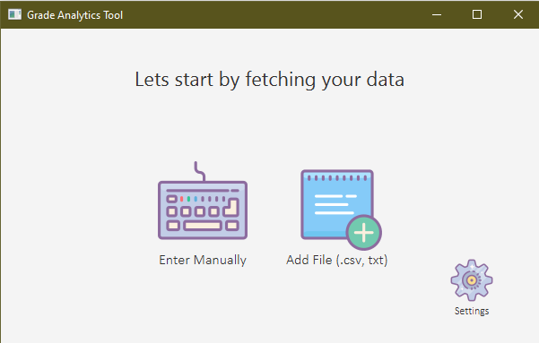
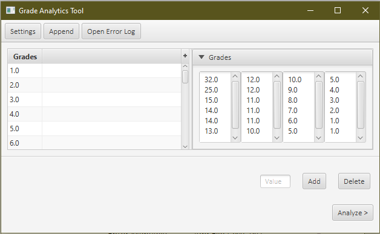
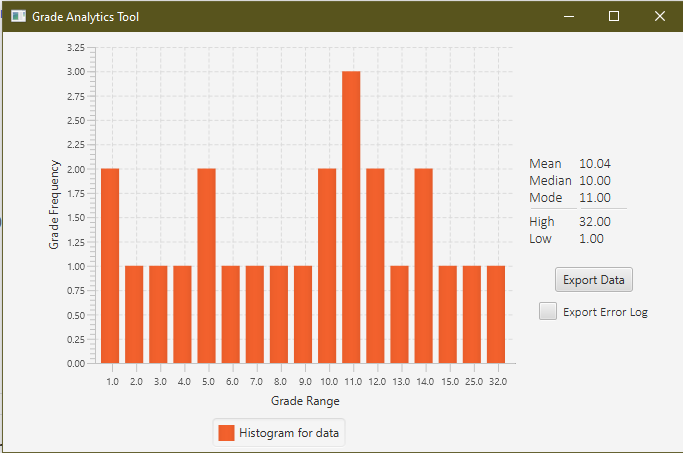

# Grade Analyzer Tool - Group 25
 CSE_360 Grade Analytics Project 
Group #25.
 
#### *Java8 was used to compile*
#### *JavaFx was used for the Graphical User Interface (GUI).*

## Beautiful GUI
*Because good software isn't just about code. Design matters*
 

   
    
   
    
   

